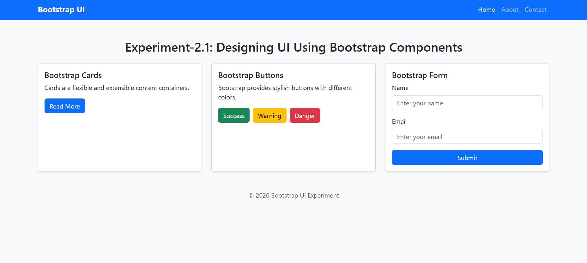

# 🧪 Experiment–1: Designing UI Using Bootstrap Components

## 🎯 Aim
To design a responsive user interface using a component library (**Bootstrap**) in a **Single Page Application (React)**.

---


## ✅ Software Requirements
- Node.js
- React (Vite)
- Web Browser
- Bootstrap

---

## 🛠 Requirements
- React
- Bootstrap

---

## ⚙️ Setup / Installation

### 1️⃣ Create React App using Vite
```bash
npm create vite@latest experiment-1-bootstrap-ui -- --template react
cd experiment-1-bootstrap-ui
npm install
2️⃣ Install Bootstrap
npm install bootstrap
3️⃣ Import Bootstrap CSS
Add this in src/main.jsx:

import "bootstrap/dist/css/bootstrap.min.css";
4️⃣ Run the Project
npm run dev
✅ Components Used
Navbar

Cards

Buttons

Forms

Grid System (container, row, col)

📌 Output
This experiment displays a responsive UI built using Bootstrap components such as navigation bar, cards, buttons, and forms.

✅ Conclusion
This experiment demonstrates how Bootstrap components help in building clean and responsive UI quickly in React.

