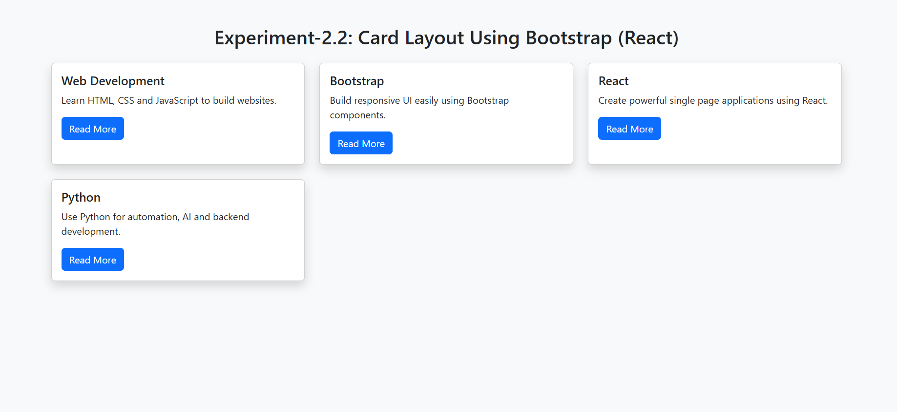

# 🧪 Experiment–2.2: Card-Based Layout Using Bootstrap

## 🎯 Aim
To create a **card-based UI layout** using **Bootstrap components** in a React application.

---

## ✅ Software Requirements
- Node.js
- React (Vite)
- Web Browser
- Bootstrap

---

## 🛠 Requirements
- React
- Bootstrap

---

## ⚙️ Setup / Installation

### 1️⃣ Create React App using Vite
```bash
npm create vite@latest experiment-2-bootstrap-cards -- --template react
cd experiment-2-bootstrap-cards
npm install
2️⃣ Install Bootstrap
npm install bootstrap
3️⃣ Import Bootstrap CSS
Add this in src/main.jsx:

import "bootstrap/dist/css/bootstrap.min.css";
4️⃣ Run the Project
npm run dev
✅ Features Implemented
Bootstrap grid system (container, row, col-*)

Bootstrap cards for UI display

Dynamic card generation using map()

Responsive layout for different screen sizes

📌 Example Working
A list/array of objects is created (card data).

Using map(), cards are rendered dynamically.

Cards are displayed in a responsive Bootstrap grid layout.

✅ Components Used
Bootstrap Cards

Bootstrap Grid system (row, col-md-*, etc.)

Buttons (optional)

✅ Conclusion
This experiment shows how to design a reusable and responsive card-based UI layout using Bootstrap and dynamically render cards using React map().