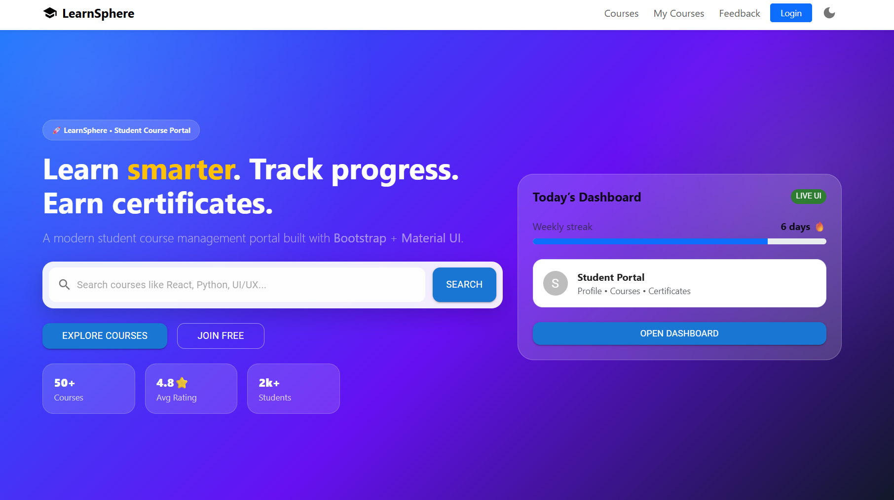
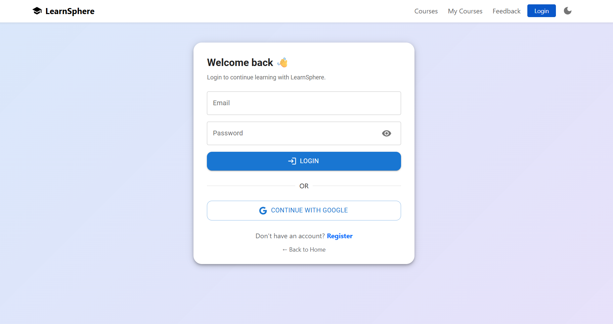
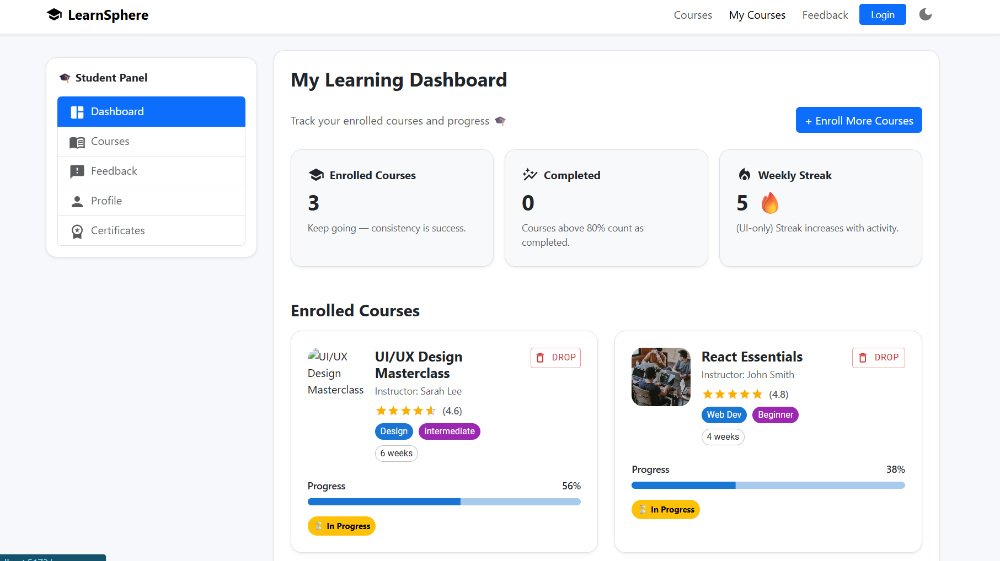

# 🎓 Student Course Management Portal (Frontend Only)

A modern **Single Page Application (SPA)** built using **React**, **Bootstrap**, and **Material UI**.  
This portal allows students to browse courses, enroll, track progress, submit feedback, and view certificates — with a premium UI/UX.

---










## 🚀 Features

### ✅ Core Features
- View available courses
- Search and filter courses (Category / Level)
- Course preview (UI)
- Enroll into courses *(stored using localStorage)*
- View enrolled courses (My Courses dashboard)
- Remove/drop enrolled courses
- Feedback form with emoji + stars + chips
- Responsive design (Mobile / Tablet / Desktop)

### ✅ Advanced UI/UX Features
- Modern Landing Page
- Premium course cards with images
- Material UI Rating component ⭐
- Skeleton loaders for courses page
- Sidebar Dashboard layout
- Profile page UI
- Certificates page UI
- Toast notifications (Snackbar alerts)

### ✅ Authentication (Frontend Only)
- Login/Register UI
- Protected routes using `ProtectedRoute`
- Login session simulated with `localStorage`

---

## 🛠 Tech Stack

### Frontend
- **React (Vite)**
- **Bootstrap 5**
- **Material UI (MUI)**
- **React Router DOM**

### Storage
- **localStorage** (for enrolled courses + login state)

---

## 📂 Project Structure

```bash
src/
 ├── assets/
 ├── components/
 │   ├── AppNavbar.jsx
 │   ├── CourseCard.jsx
 │   ├── CourseCardSkeleton.jsx
 │   ├── DashboardLayout.jsx
 │   ├── Footer.jsx
 │   ├── ProtectedRoute.jsx
 │   └── ToastMsg.jsx
 ├── context/
 │   └── AppContext.jsx
 ├── data/
 │   └── courses.js
 ├── pages/
 │   ├── Home.jsx
 │   ├── Courses.jsx
 │   ├── MyCourses.jsx
 │   ├── Feedback.jsx
 │   ├── Login.jsx
 │   ├── Register.jsx
 │   ├── Profile.jsx
 │   ├── Certificates.jsx
 │   └── NotFound.jsx
 ├── App.jsx
 ├── main.jsx
 └── index.css
⚙️ Installation & Setup
1️⃣ Clone the repository
git clone <your-repo-link>
cd student-course-portal
2️⃣ Install dependencies
npm install
3️⃣ Start the development server
npm run dev
Project will run at:

http://localhost:5173
🔐 Protected Routes
These pages require login:

/my-courses

/feedback

/profile

/certificates

Login is simulated using:

localStorage.setItem("isLoggedIn", "true");
🧠 Local Storage Usage
Data	Key Used
Dark Mode	darkMode
Enrolled Courses	enrolledCourses
Login State	isLoggedIn
📸 Screens / Pages
Landing Page

Courses Page

My Courses Dashboard

Feedback Page

Login/Register UI

Profile Page

Certificates Page

404 Not Found Page

✅ Future Enhancements
Backend integration (API for courses, authentication, feedback)

Course detail page /course/:id

Certificate download as PDF

Admin Panel UI (Add / Update Courses)

Real authentication with JWT

👨‍💻 Developed By
Your Sathya Reddy
Student Course Management Portal Project
(React + Bootstrap + Material UI)